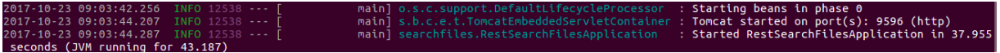
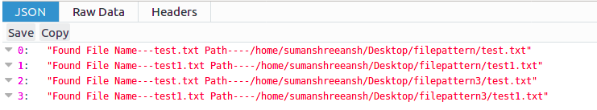
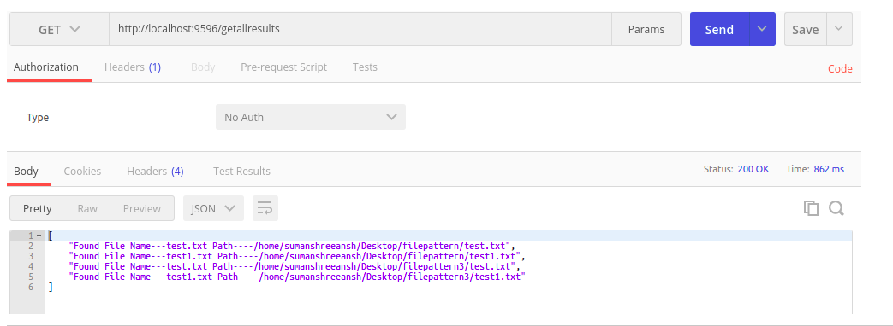

# POC TO SEARCH THE FILES BASED ON A GIVEN STRING
Springboot poc for searching the files with a string pattern

## Overview

  * [Software Used](#software-used)
  * [Project Structure](#project-structure)
  * [Running POC](#running-poc)
  * [Testing Application](#testing-application)
  * [Related Artifacts](#related-artifacts)
  

### Introduction

The main aim of this exercise is to ensure that the restful webservice is production ready and given an folder structure and the pattern to search it should do an recursive search on the directory and find all the files based on the pattern.
Once the files are found it would add the results in the ArrayList and pass the results as JSON objects to the browser that can be verified in the Postman.

## Software Used
- Eclipse & Embedded Maven
- PostMan
- Code Coverage Tools like : JACOCO
- Spring Boot 1.4.7
- Ubuntu  16.0.4 LTS ( 64 bit)
- Browsers : Chrome, Chromium, FireFox
- Test Coverage Tools : JUnit and MockMVC
- Logging Tools : SLF4j
- Front End : Boots Trap and Thymeleaf
- Java :8 ( 64 bit)

## Project Structure
- Project Name : RestSearchFiles
- Controller: The controllers are placed in the package ( searchfiles.controller)
- Model: The Model for the POC is places in ( searchfiles.model)
- View : The View( Index.html) is placed in the src/main/resources/templates, the tomcat embedded runs on the port 9596

## Running POC
- Download the zip or clone the Git repository.
- Unzip the zip file (if you downloaded one)
- Open Command Prompt and Change directory (cd) to folder containing pom.xml
- Open Eclipse 
   - File -> Import -> Existing Maven Project -> Navigate to the folder where you unzipped the zip
   - Select the right project
- Choose the Spring Boot Application file (search for @SpringBootApplication)
- Right Click on the file and Run as Java Application
- You are all Set

## Testing Application
- Open the Browser ( Prefer to open Firefox )
- type in http://localhost:9596/
- The index.html page opens up
- Enter the path and the phrase to search.
- Once the results are found you can see them as JSON objects.

## Related Artifacts
- **API**
  - API Used To Construct the Logic: 
   - I used the API's from the https://github.com/fge/largetext  to construct my logic.
   - The logic that is iterates recursively  if there is a sub directory and for around 1000+ files on my desktop it takes        **1.12 sec** for the results to populate when I run my Spring boot - Junit test cases.
   - Earlier I have used my  logic with regular expressions but it is  taking more time and then considered the above API for      better performance.
   
 - **Model & Controller**
   - Have created the Model and Controller in my solution.
   - The model contains the main logic which is controlled by Spring (using @component).This is where I am looping through ,       however the buffering is done by the above API for largetext.
   - Seperated the controller part to facilitate the restful api call
  
  - **JUnit Test Cases**
   -Have created the three normal Junit test cases to check the logic of the code to do the following
    - Actual and Expected results when the file is created and search for a text in the file under a fixed directory.
    - Actual and Expected results when the files are created under the subdirectories for testing the recursive calls (             Tested only the first level of sub directory)
    - To check the size of the Expected and Actual as my logic will return an arraylist which spring converts into JSON.
  
  - **Spring Boot JUnit Test Cases**
    - Run the entire logic to search for a pattern ( String ) when the sub directory path is given. - Used Mock MVC
    - Check the health status using - Spring Boot Actuator - Used Mock MVC
    - General test case to "/"  using Mock MVC.
  
  - **JAR Generation and Exection outside IDE**
    - Did an mvn clean install on the command line to generate  JAR file ( The entire process along with the test case             execution is taking around 3 min on an Ubuntu  16.04LTS machine)
    - Ran JAR  ( java -jar target/restsearchfiles-0.0.1-SNAPSHOT.jar ) outside the IDE and was able to bring up the UI and         search.
     - Starting Tomcat service on custom port 9596 outside IDE
     
      
      
     - View to Launch The Search Page
     
      
            
      - Output Rendering Of The Search In JSON
       
       
      - POSTMAN Reendering Output
       
